# 💻 eLabTracker – Virtual College Lab Record System

**eLabTracker** is a full-stack web application designed for Computer Science and Engineering students and faculty to efficiently manage laboratory records, experiments, and student submissions.  
It provides a digital platform where **faculty** can create labs, add experiments, review submissions, and assign grades — while **students** can submit lab reports in PDF format and track their progress.

---

## 🧩 Features

### 👩‍🏫 For Faculty
- Create labs with subject and semester details.
- Add experiments with titles, aims, and procedures.
- View and evaluate student submissions.
- Grade and provide feedback on submitted reports.
- Secure, role-based dashboard access.

### 👨‍🎓 For Students
- Submit lab reports in **PDF** format.
- View submission status and feedback.
- Track progress across multiple labs and experiments.
- Simple, user-friendly interface.

### ⚙️ General
- **Role-based authentication**: Students vs Faculty.
- **JWT-based security** for protected endpoints.
- **MongoDB file Object** for secure PDF storage.
- Clean, responsive frontend built with **React.js**.
- Organized codebase with clear separation of frontend and backend.

---

## 🛠️ Tech Stack

| Layer | Technologies |
|:------|:--------------|
| **Frontend** | React.js, React Router, CSS |
| **Backend** | Node.js, Express.js |
| **Database** | MongoDB (Atlas) |
| **File Uploads** | Multer middleware |
| **Authentication** | JSON Web Tokens (JWT) |
| **Storage** | MongoDB file object, cloudinary free cloud storage |
| **Tools** | Postman, Git, npm |

---

## 🖼️ Screenshots

### 🏠 Home Page
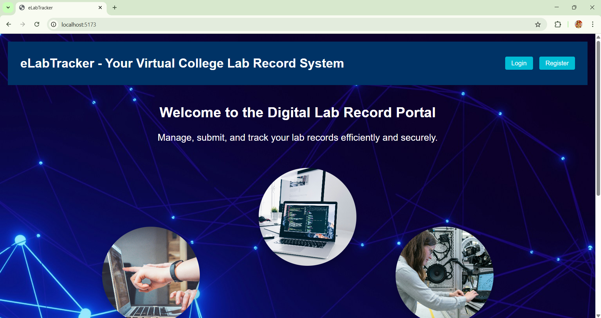

### 🏠 Intro and Footer in Home Page
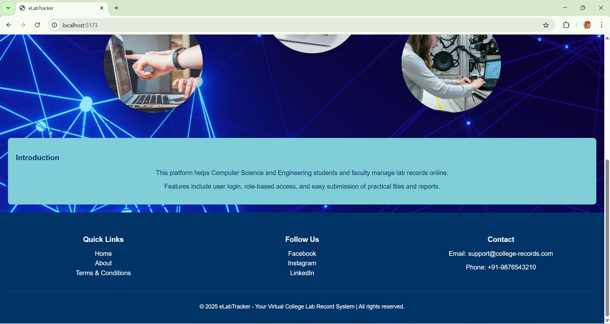

### 🔐 Login Page
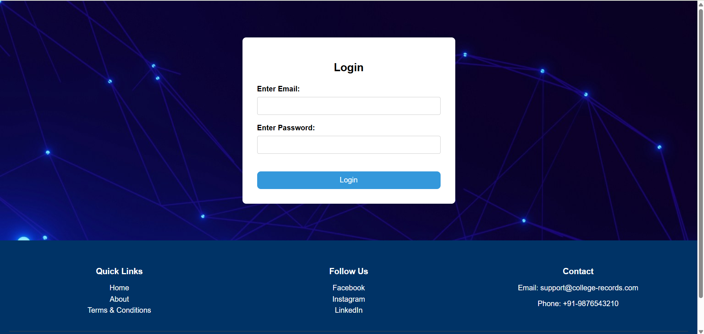

### 🔐 Register Page
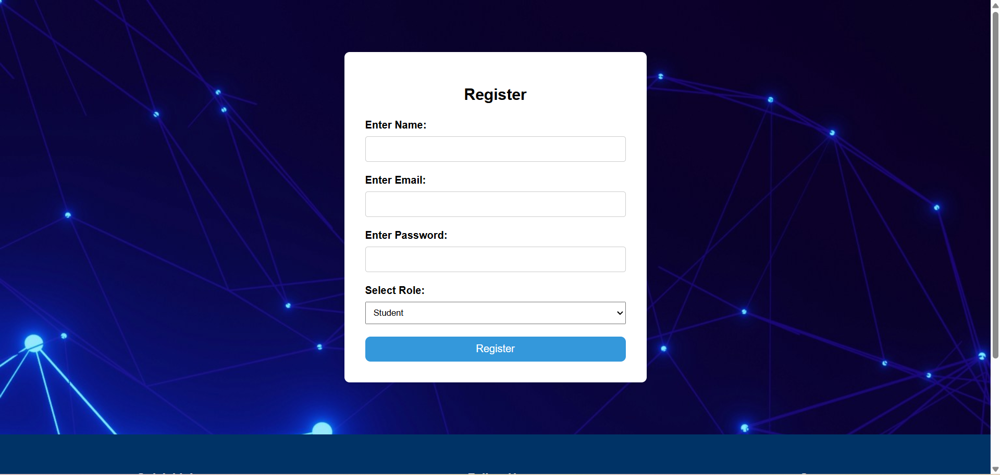

### 🧑‍🏫 Faculty Dashboard
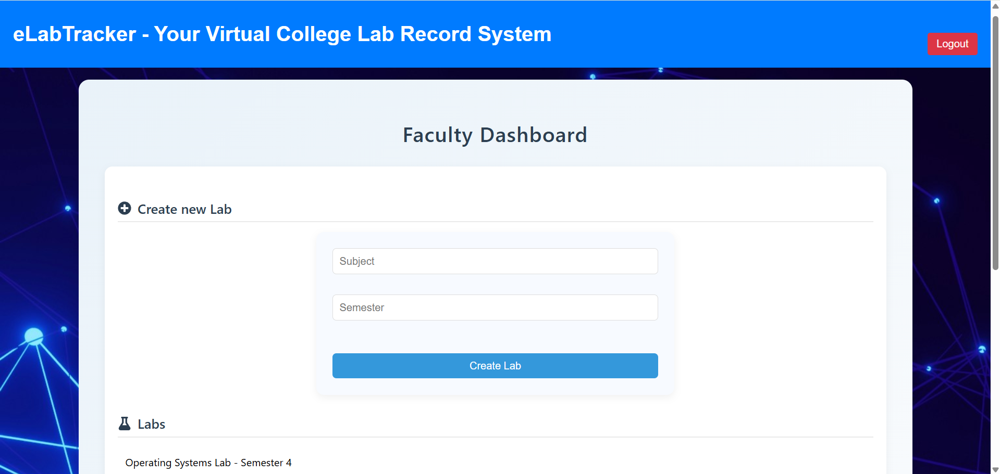
<br>
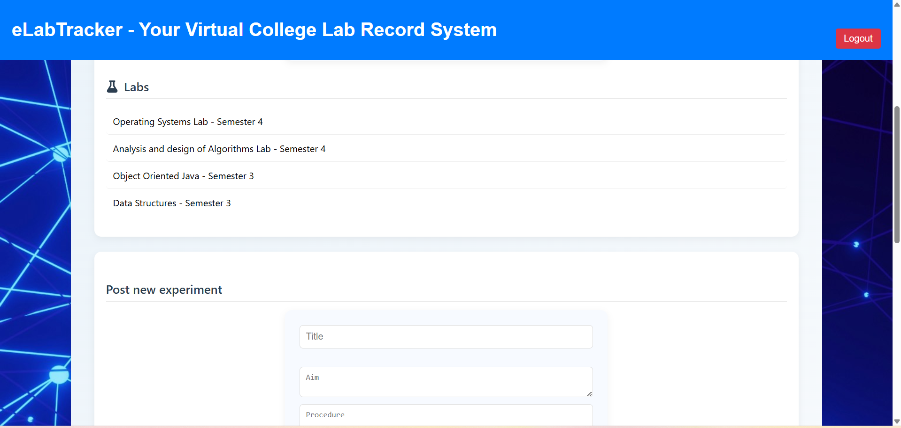
<br>
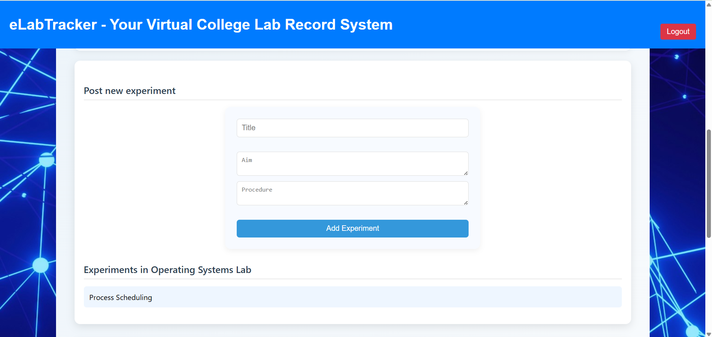
<br>
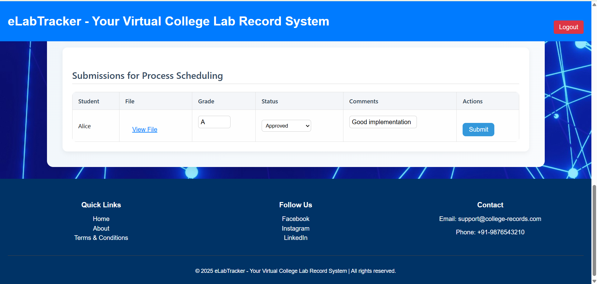


### 👩‍🎓 Student Dashboard
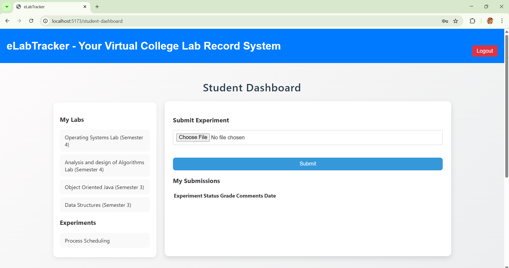

### 📄 About eLabTracker
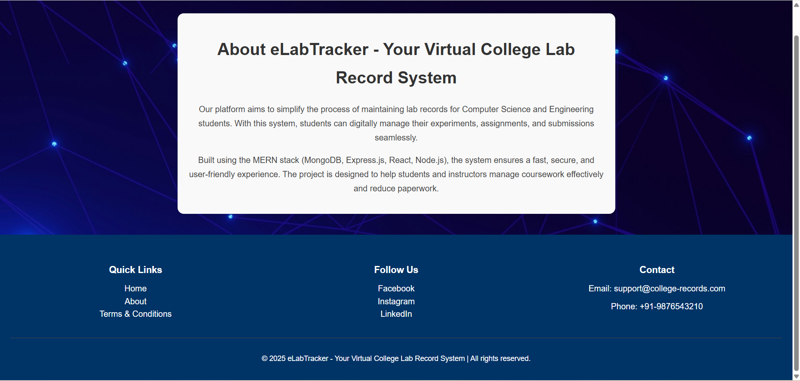

### 📄 Terms and Conditions Page
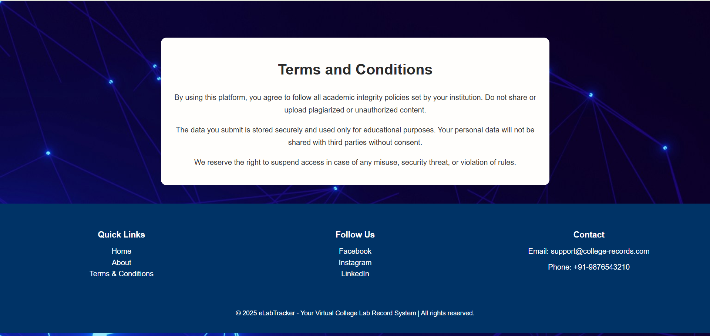

---

## ⚙️ Installation & Setup (Local Environment)

Follow these steps to run the project locally:

### 1️⃣ Clone the Repository
```bash
git clone https://github.com/Pai-Pratheeksha/eLabTracker.git
cd eLabTracker
```

### 2️⃣ Backend Setup
```bash
cd backend
npm install

Create a .env file inside the backend/ directory and add the following variables:

MONGO_URI=<your_mongodb_connection_string>
JWT_SECRET=<your_jwt_secret_key>
PORT=5000


Start the backend server:
npm run dev

The backend will start on http://localhost:5000
```

### 3️⃣ Frontend Setup
```bash
Open a new terminal and navigate to the frontend folder:

cd frontend
npm install
npm run dev


The frontend will start on http://localhost:5173
```

### 🗂️ Project Structure
```bash
eLabTracker/
│
├── backend/
│   ├── controllers/      # All API route handlers
│   ├── middleware/       # Auth and upload middleware
│   ├── models/           # Mongoose models (User, Lab, Experiment, Submission)
│   ├── routes/           # Express route definitions
│   ├── config/           # Cloudinary setup
│   ├── server.js         # Express app entry point
│   └── package.json
│
├── frontend/
│   ├── src/
│   │   ├── components/   # Reusable components (Navbar, Footer, etc.)
│   │   ├── pages/        # Page components (Login, Register, Dashboard, etc.)
│   │   ├── services/     # Axios API service functions
│   │   ├── App.jsx
│   │   ├── main.jsx
│   │   └── index.css
│   └── package.json
│
└── README.md
```

### 🔒 Authentication & Authorization

- Users can register as either student or faculty.
- Authentication handled using JWT tokens, stored securely on the frontend.
- Middleware ensures proper access.
- protect → verifies token validity.
- isFaculty → restricts faculty-only routes.

### 🧠 How to Use

**👥 User Registration & Login**

- Students and faculty register and log in with email and password.
- Token is stored in localStorage for authentication.

**🧑‍🏫 Faculty Dashboard**

- Create labs and add experiments.
- Review student submissions.
- Assign grades and feedback.

**👩‍🎓 Student Dashboard**

- View available labs and experiments.
- Submit lab PDFs.
- Track submission status and feedback from faculty.

### 📂 File Handling

- Files are uploaded using Multer and stored in cloudinary storage, but due to some constraints MongoDB file object is used here with a limit on file upload size.
- Cloudinary setup codes has been commented, you can get your cloudinary credentials and uncomment those to try cloudinary storage.
- Faculty can securely view uploaded reports.

### 🚧 Future Enhancements

- 📧 Email notifications to faculty for new submissions and password reset feature.
- 📊 Export grades and submissions (CSV or PDF).
- 🔔 Real-time dashboard updates using WebSockets.
- 📈 Analytics for student performance tracking.
- ☁️ Cloud deployment (Render / Railway / Vercel).

### ⚠️ Current Status

This project is currently under development and not yet deployed.
All core functionalities work in a local environment setup.
